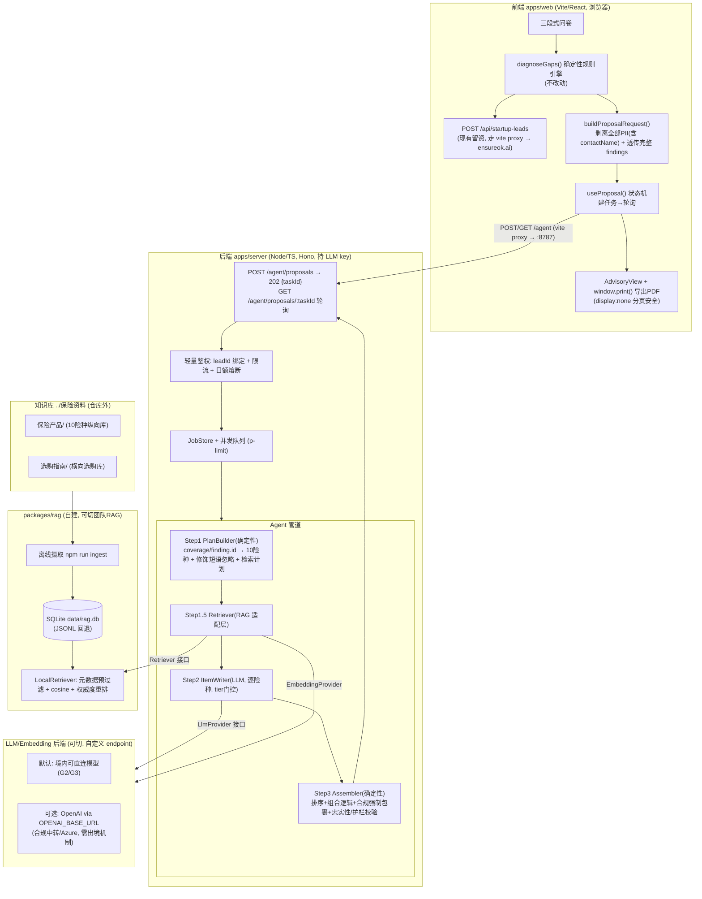

# 保障方案生成子系统(Agent + RAG)· PR1 设计文档

> 版本:PR1-design v2.0(对抗评审后修订)· 日期:2026-07-09
> 定位:本文件是"从三段式问卷诊断结果 →一份可打印的**风险保障方向说明(Advisory)**"整条链路的**单一权威设计**。综合了知识库盘点、方案结构提炼、输入契约实测,以及 RAG / Agent 管道 / 后端 API / 前端接入四份子设计,合并冲突、定死可定项,作为后续 PR2–PR5 的实现依据。
>
> **v2.0 变更提要(对抗评审处理):** ① 交付物由"方案合同 / Proposal 合同"更名为**"风险保障方向说明"**,并把"是否可指名保司"升级为**上线前法务硬门(§0)**;② 保费红线改为**服务端硬编码强制**,不采信客户端字段;③ 个人信息**出境(PIPL)独立立项**,`contactName` 明确进剥离清单;④ OpenAI **大陆不可达**给出 `OPENAI_BASE_URL` / 境内模型兜底与总超时预算;⑤ 幻觉护栏从"可溯源"升级到**"忠实性校验"**;⑥ 打印、Windows dev、PDF 抽取、JobStore、映射、Monorepo、鉴权限流等 High/Medium 项逐条落地。文末 §13 附"评审已处理的风险清单"。

---

## 0. 上线前置硬门(Blocking Gates)——写第一行代码前必须闭环

对抗评审把三条从"返工级"重新定性为**"能不能上线 / 能不能开工"级**。本节把它们前置为**硬门**:未拿到明确结论前,PR2 不得开工对应部分。

| 门 | 问题 | 谁裁决 | 阻塞范围 | 默认保守态(未裁决前) |
|---|---|---|---|---|
| **G1 · 中介牌照定性** | "针对某公司、指名保司 + 建议保额 + 关键条款 + 配置理由、可打印成文书"是否越过"无牌从事保险中介 / 出具投保建议书"红线 | 法务 + mentor(**书面结论**) | 保司指名功能、文档命名、CTA | `INSURER_NAMING_MODE=direction`(只给"主流承保方向",不指名到具体保司);产物名"风险保障方向说明",非"合同/Proposal" |
| **G2 · 个人信息出境** | 把公司画像发往 OpenAI(美国)= 个人信息出境,需 PIPL 单独同意 + 出境机制 | 法务 | 是否允许调用境外 LLM/Embedding | 默认走**境内可直连模型**;境外模型需先落地出境机制才可启用 |
| **G3 · 网络可达性** | OpenAI API 在中国大陆无法直连,摄取与运行时都会失败 | 工程(需给出可达方案) | 摄取(PR2)、生成(PR4) | 必须先确定 `OPENAI_BASE_URL`(合规中转 / Azure OpenAI / 境内模型)并实测连通,否则 PR2 摄取不开工 |

> 这三门在 §9(合规)、§5/§6/§10(可达性与兜底)有落地设计;§12 未决事项已把它们从"确认文字"升级为"能否做"。**结论未闭环前,相关代码不写。**

---

## 1. 概述与目标

### 1.1 现状

现仓 `ensureok-startup-collector` 是纯前端(Vite + React + TypeScript)保险"缺口诊断采集器":用户填三段式问卷 → 纯前端确定性规则引擎 `diagnoseGaps` 输出"缺口 + 保障大类(coverage)"→ 提交留资到 EnsureOK 的 `/api/startup-leads`。`diagnoseGaps` 是非 LLM 的确定性纯函数,只到"保障大类"为止(合规红线),不含保司/产品/价格。

现有合规资产(实测已上线、有测试断言,**本子系统必须继承不破坏**):

- `COLLECTOR_PRIVACY_NOTICE`(逐字):`"提交即表示同意确石智能就保障诊断结果通过电话/微信与你联系。信息仅用于生成诊断报告,不会用于其他目的,可随时要求删除。同意不是获取诊断的条件。"`(测试断言含 `仅用于`/`删除`/`同意不是获取诊断的条件`)
- `COLLECTOR_DISCLAIMER`(逐字,关键冲突点):含 `"不构成投保建议,不涉及任何具体保险产品与价格"` + 持牌出单披露 + `"不销售保险产品"`(测试断言含 `不构成投保建议`/`持牌`/`不销售保险产品`)。

> ⚠️ **实测冲突已坐实**:现有 `COLLECTOR_DISCLAIMER` 明文写着"不涉及任何具体保险产品与价格",而新方案要"指名保司 + 给保额 + 列条款要点"。这不是措辞润色,而是**对外承诺的实质变更**,必须走 G1 法务门,见 §9.1。

### 1.2 本子系统要做什么

在**不改动现有诊断规则**的前提下,新增一套 **Agent + RAG** 能力:用户提交后,前端把"完整诊断结果 + 剪枝画像(不含 PII)"发给新后端;后端用 RAG 检索本仓自建的保险知识库,由 LLM 逐险种生成一份**风险保障方向说明(Advisory)**,含承保方向 / 建议保额区间 / 关键条款要点 / 配置理由;前端异步等待、渲染,并用浏览器 `window.print()` 导出 PDF。

> **命名纪律(G1):** 全系统对外文案、文件名、UI 标题一律用"风险保障方向说明 / 保障方向建议",**不出现"合同""Proposal 合同""投保建议书""报价单"**字样。代码内部类型名 `Proposal*` 保留(仅为工程符号,不外显),但任何用户可见字符串走 `compliance/` 常量,禁止硬编码"合同"。

### 1.3 核心设计原则

1. **确定性的事留在代码,知识性的事交给 LLM+RAG。** 选哪些险种、优先级排序、合规文案、保费/招揽/保司红线 = 规则代码;保额措辞、条款要点提炼、承保方向、理由段落 = LLM 基于 RAG 证据。最大限度压缩幻觉面。
2. **前后端诊断唯一事实来源。** `diagnoseGaps` 只在前端跑一次,后端**不重跑规则引擎**,只消费透传来的 `findings`,避免规则漂移。
3. **每条 LLM 生成的事实既可溯源、又须忠实。** 承保方向 / 条款要点 / 保额区间都必须挂 `citationIds` 指向 RAG 来源;**且条款级文本须通过忠实性校验(近似原文,不得改写文义)**,否则作废或降级为"证据不足"(见 §6.4)。这是"不得编造、也不得曲解保司/条款"的可审计基础。
4. **可插拔。** LLM、Embedding、Retriever 全走接口抽象,且**接口天然支持自定义 endpoint / 超时 / 重试**(为 G3 可达性服务);切团队 RAG 或换模型,只改工厂一处。
5. **Key 只在后端,且不进 web 打包图。** OpenAI key 只存在于 `apps/server/.env`,不带 `VITE_` 前缀;`packages/shared` 零运行时依赖,任何读 `process.env` 的 server 模块靠目录纪律 + lint 规则禁止被 web 引入。
6. **合规红线由服务端强制 + 类型 + 校验三重兜底,而非靠"记得"或"客户端配置"。** 保费**服务端硬编码不渲染**(不采信请求字段)、保司无价字段、mandatory 严格两类、出境 PII 剥离,都在服务端强制层落地。

### 1.4 交付边界

本 PR(PR1)只产出**本设计文档**。代码分 PR2–PR5 落地(见 §11)。**PR2 开工以 §0 三门闭环为前提。**

---

## 2. 总体架构

### 2.1 运行时数据流



### 2.2 开关(env 单点切换)

| 开关 | 值 | 作用 |
|---|---|---|
| `RAG_MODE` | `local`(默认) / `team` | `LocalRetriever` 自建 RAG 还是 `TeamRagRetriever` 转调团队 RAG |
| `LLM_PROVIDER` | `stub` / `openai` / `domestic` | 桩 / OpenAI(经 `OPENAI_BASE_URL`)/ 境内直连模型。**默认非 openai**,见 G2/G3 |
| `EMBEDDING_PROVIDER` | `openai` / `domestic` | 与上同源,单独可切(摄取与运行时可用不同后端) |
| `INSURER_NAMING_MODE` | `direction`(默认) / `named` | **G1 合规硬门**:`direction`=只给"主流承保方向"不指名;`named`=指名 1–3 家保司,**仅在法务书面放行后由 env 显式打开** |
| `VITE_PROPOSAL_PROVIDER` | `mock`(默认) / `http` | 前端用假数据还是真后端 |

> **红线开关不进客户端。** `INSURER_NAMING_MODE`、保费门控只在服务端生效;客户端**无任何**能翻开红线的字段(见 §4.3 对 `showPremium` 的处理)。

---

## 3. Monorepo 目录布局

采用 **npm workspaces**(现仓即 npm + `type: module` ESM)。把现有前端整体迁入 `apps/web`(纯移动,构建行为零改动),新增后端服务、RAG 库、共享契约包。

```
ensureok-startup-collector/            # workspace 根,只做编排
├─ package.json                        # workspaces + 跨平台并行脚本(concurrently, 见 §3.2)
├─ package-lock.json
├─ tsconfig.base.json                  # 共享 compilerOptions;含 shared 的 paths 映射(§3.3)
├─ .gitignore                          # 已含 .env / .env.*.local;新增 data/rag.db、apps/server/.jobs/
├─ .env.example
├─ apps/
│  ├─ web/                             # ← 现有前端整体迁入(index.html/src/vite.config.ts/tests 原样)
│  │  ├─ src/
│  │  │  ├─ config/startupProfileCollector.ts   # diagnoseGaps 规则实现(保留前端)
│  │  │  ├─ components/StartupProfileCollector.tsx
│  │  │  ├─ api/config.ts              # apiUrl + 新增 agentUrl
│  │  │  └─ proposal/                  # 前端接入层(见 §8)
│  │  │     ├─ provider.ts / mockProvider.ts / httpProvider.ts
│  │  │     ├─ useProposal.ts
│  │  │     ├─ AdvisoryView.tsx / print.css   # 分页安全打印(§8.4)
│  │  │     ├─ lineMap.ts
│  │  │     └─ compliance.ts           # 方案专用固定文案(继承 + 新拟)
│  │  ├─ vite.config.ts                # 仅新增 /agent proxy(见 §7.5)
│  │  ├─ tsconfig.json
│  │  └─ package.json
│  └─ server/                          # ← 新后端(Hono),持 LLM key、跑 Agent 管道
│     ├─ src/
│     │  ├─ index.ts
│     │  ├─ routes/proposals.ts
│     │  ├─ routes/health.ts
│     │  ├─ jobs/JobStore.ts           # MemoryJobStore / FileJobStore(原子写)
│     │  ├─ jobs/queue.ts
│     │  ├─ pipeline/                  # PlanBuilder / ItemWriter / Assembler
│     │  ├─ mapping/                   # coverage/finding.id → 险种 code + 修饰短语忽略表
│     │  ├─ compliance/                # 固定文案 + 服务端强制器(保费/招揽/保司白名单/忠实性)
│     │  ├─ llm/                       # LlmProvider/EmbeddingProvider + Stub/OpenAI/Domestic(自定义 endpoint)
│     │  ├─ config/env.ts              # zod 校验 .env,fail-fast(含 base_url/超时预算)
│     │  └─ middleware/{cors,rateLimit,bodyLimit,auth}.ts
│     ├─ .env.example
│     ├─ tsconfig.json
│     └─ package.json
└─ packages/
   ├─ shared/                          # 前后端共享契约(纯类型 + 少量纯函数,零运行时依赖)
   │  ├─ src/{collector,insurance,contract,index}.ts
   │  └─ package.json                  # exports 指向 TS 源码(§3.3)
   └─ rag/                             # 自建 RAG
      ├─ src/{ingest,retrieve,store,adapters,mapping,types}
      ├─ bin/ingest.ts
      └─ package.json
```

### 3.1 迁移动作(一次性、机械、构建零风险)

1. `index.html`、`src/`、`vite.config.ts`、`tsconfig.json`、`tests/` → 移到 `apps/web/`。vite/tsc 行为不变。
2. 把 `GapFinding` / `CollectorDiagnosis` / `QuestionId` 等**类型定义**抽到 `packages/shared/src/collector.ts`;规则实现 `diagnoseGaps` **仍留前端**。
3. 知识库 `保险资料/` 在仓库**外**(`../保险资料`),不拷进仓库;摄取脚本用 `.env` 的 `RAG_SOURCE_ROOT` 指路。生成物 `data/rag.db` 走 `.gitignore`。

### 3.2 根 package.json 脚本编排(**跨平台并行,修正 Windows `&` 缺陷**)

> **评审 #7 已修:** 原 `"dev": "... server & ... web"` 中的 `&` 是 bash 后台符;本机是 Windows,npm 走 cmd.exe,`&` 是顺序分隔符,常驻的 server watch 会阻塞 web 永不启动。改用 `concurrently` 显式并行。

```jsonc
{
  "workspaces": ["apps/*", "packages/*"],
  "devDependencies": { "concurrently": "^9" },
  "scripts": {
    "dev":         "concurrently -k -n server,web -c cyan,magenta \"npm:dev:server\" \"npm:dev:web\"",
    "dev:web":     "npm -w @ensureok/web run dev",
    "dev:server":  "npm -w @ensureok/server run dev",
    "ingest":      "npm -w @ensureok/rag run ingest",
    "ingest:pdf":  "npm -w @ensureok/rag run ingest -- --only pdf",
    "build":       "npm -w @ensureok/shared run build && npm -w @ensureok/web run build && npm -w @ensureok/server run build",
    "typecheck":   "npm run -ws --if-present typecheck",
    "test":        "npm run -ws --if-present test"
  }
}
```

`-k`(kill-others)保证一个挂全挂,便于 dev 感知崩溃;`concurrently` 在 Windows/macOS/Linux 行为一致。

### 3.3 Monorepo 解析纪律(**修正 typecheck/test 隐患**)

> **评审 #11 已修:** 若 `@ensureok/shared` 只导出 `dist`,则 `dev`/`test`/`typecheck`(根脚本未先 build shared)会解析失败;web 用 `moduleResolution: bundler` + `allowImportingTsExtensions`,server 用 `NodeNext`,两套规则消费同一 shared 易冲突。

落地纪律:
1. **`packages/shared` 以 TS 源码作为入口**:`package.json` 的 `exports` 指向 `./src/index.ts`(配合 `tsconfig.base.json` 的 `paths: { "@ensureok/shared": ["packages/shared/src/index.ts"] }`),让 web 的 bundler(Vite/esbuild)、vitest、server 的 tsc 都直接吃源码——**无需"先 build shared"**。`shared` 保持零运行时依赖、纯类型 + 纯函数,规避两套 `moduleResolution` 的运行时差异。
2. **shared 内部 import 不带 `.ts` 扩展名、不依赖 `allowImportingTsExtensions`**,使其对 `bundler` 与 `NodeNext` 双兼容;server 侧若 `NodeNext` 严格要求扩展名,则通过 `paths` 直接映射到源码目录绕过。
3. **vitest 配 workspace**(vitest v4),web 的 `tests/*.test.ts` 迁入 `apps/web/tests/` 后,导入路径 `../src/config/...` 同步改为迁入后的相对路径;从 shared 抽出的类型改 `import type { GapFinding } from '@ensureok/shared'`。
4. PR2 验收把 `test` + `typecheck` **在迁移同一 PR 内跑绿**作为硬门,不允许"迁移与修测试分两 PR"。

---

## 4. 数据契约(TypeScript)

全部契约集中在 `packages/shared`,前后端唯一事实来源。

### 4.1 险种枚举(双表:中文对齐知识库,英文对齐 API)

```ts
export type InsuranceLineCode =
  | 'employer_liability'   // 雇主责任险
  | 'group_accident'       // 团体意外险
  | 'public_liability'     // 公众责任险
  | 'product_liability'    // 产品责任险
  | 'do_liability'         // 董责险 D&O   ← 全仓统一用 do_liability(非 dno)
  | 'cyber'                // 网络安全险
  | 'tech_eo'              // Tech E&O
  | 'ai_liability'         // AI 服务责任险
  | 'ip_insurance'         // 知识产权保险
  | 'coi_service';         // COI 出具服务

export type InsuranceLine =
  | '雇主责任险' | '团体意外险' | '公众责任险' | '产品责任险' | '董责险D&O'
  | '网络安全险' | 'Tech E&O' | 'AI服务责任险' | '知识产权保险' | 'COI出具服务';

export const LINE_CODE_TO_CN: Record<InsuranceLineCode, InsuranceLine> = {
  employer_liability: '雇主责任险', group_accident: '团体意外险',
  public_liability: '公众责任险', product_liability: '产品责任险',
  do_liability: '董责险D&O', cyber: '网络安全险', tech_eo: 'Tech E&O',
  ai_liability: 'AI服务责任险', ip_insurance: '知识产权保险', coi_service: 'COI出具服务',
};

export const INSURANCE_LINE_LABELS: Record<InsuranceLineCode, string> = {
  employer_liability: '雇主责任险', group_accident: '团体意外险',
  public_liability: '公众责任险', product_liability: '产品责任险',
  do_liability: '董监事及高级管理人员责任保险(D&O)', cyber: '网络安全保险',
  tech_eo: '科技类职业责任(Tech E&O)', ai_liability: 'AI 服务责任险',
  ip_insurance: '知识产权保险', coi_service: 'COI 出具服务',
};

export type ProposalTier = 'tier1' | 'tier2' | 'tier3' | 'tier4';
```

### 4.2 诊断类型(从现有前端抽出,不改语义)

```ts
export type GapUrgency = 'mandatory' | 'high' | 'advice';
export interface GapFinding {
  id: string;
  line: 'line_a' | 'line_b' | 'line_c' | 'company';
  title: string;
  desc: string;
  coverage: string;   // 自由文本保障大类,常含 '+' 组合与修饰短语;不可直接当键查 RAG
  urgency: GapUrgency;
  subsidy?: string;
  note?: string;
}
export interface CollectorDiagnosis { findings: GapFinding[]; total: number; mandatoryCount: number; }
export type QuestionId =
  | 'headcount' | 'industry' | 'funding' | 'patent'
  | 'a1' | 'a2' | 'b0' | 'b1' | 'b2' | 'c1' | 'c2' | 'c3';
```

### 4.3 输入契约:`ProposalRequest`(**PII 剥离清单显式化**)

> **评审 #3 已修:** 原契约仍带 `contactName`(联系人姓名=个人信息),文档却声称"已剥离 PII"。现明确:**发往 LLM 的 prompt 绝不含 `contactName`;`company` 仅作抬头、也不进 prompt 的"事实推断"部分,仅在 Assembler 组装展示层回填**(见 §6.4 输入白名单)。

```ts
export interface ProposalClientProfileInput {
  version: 'collector_v1';
  answers: Partial<Record<QuestionId, string>>; // 已按 visibleQuestions 剪枝(与 handleSubmit 同款 prunedAnswers)
  industryOther?: string;
  fundingAmount?: string;                        // 保费不显示;融资额仅用于保额/规模推断(区间化,不透传原文到日志)
  overseasCountries?: string[];
  // ⚠️ 硬约束:无 phone/wechat/contactName —— 任何 PII 不进本对象
}

export interface ProposalRequest {
  profile: ProposalClientProfileInput;
  diagnosis: { findings: GapFinding[]; total: number; mandatoryCount: number };
  selectedEvents: string[];
  company: string;                               // 抬头展示用;不进 LLM 事实链路(§6.4)
  // contactName 已移除出请求体:抬头联系人由前端本地渲染,不回传后端、不入库、不进 prompt
  source?: string;
  leadId?: string;                               // 轻量鉴权绑定(§7.6)+ 回传关联
  // options.showPremium 已删除 —— 保费门控服务端硬编码,不采信任何客户端字段(评审 #2)
  options?: { locale?: 'zh-CN' };
}
```

**评审 #2(showPremium 客户端可翻开红线)落地:**
- `showPremium` **从输入契约删除**;服务端 Assembler **硬编码 `meta.showPremium = false`**,`estPremium` 字段永不填充。
- 若将来产品确需内部预览保费,只能通过**服务端受信配置**(非请求体)开启,并单列内部路由;客户端无任何路径可开。
- 护栏单测:构造带任意 `options.showPremium=true` 的伪造请求,断言输出 `meta.showPremium===false` 且无任何保费字段。

### 4.4 输出契约:`Proposal`(前端渲染的唯一结构)

> 类型符号沿用 `Proposal*`(内部工程名),但所有**用户可见字符串**走 `compliance/` 常量,不出现"合同"。

```ts
export interface Proposal {
  meta: ProposalMeta;
  clientProfile: ClientProfileSummary;
  summary: ProposalSummary;
  items: ProposalItem[];
  disclaimer: ProposalDisclaimer;
}

export interface ProposalMeta {
  proposalId: string;
  version: string;               // 'advisory_v1'
  generatedAt: string;
  engine: string;                // 'ensureok-agent/2.0'
  llmModel?: string;             // 记录实际后端(含是否 stub / 境内模型)
  validityNote: string;          // "费率/条款可能变动,建议 30 天内决策"
  showPremium: false;            // ★ 字面量类型锁死 false —— 服务端强制,客户端无法改
  insurerNamingMode: 'direction' | 'named'; // 反映服务端 G1 开关的实际取值,供审计
  companyName: string;
  citations: ProposalCitation[];
  warnings: string[];            // "无命中缺口→兜底""某险种证据不足""某保司名未过白名单已剔除"等
}

export interface ClientProfileSummary {
  companyName: string;
  industry: string;
  headcount: string;
  fundingStage: string;
  hasPatent: boolean;
  overseas?: { countries: string[]; note?: string };
  // 注:不含 contactName;联系人抬头前端本地渲染
}

export interface ProposalSummary {
  headline: string;
  gapCount: number;
  mandatoryCount: number;
  riskTiers: string[];
  gaps: Array<{ id: string; title: string; urgency: GapUrgency; lines: InsuranceLineCode[] }>;
  matchedScheme?: string;
  layeringLogic?: string;
  synergyNotes?: string[];
  rolloutPlan?: string[];
}

export interface ProposalItem {
  lineCode: InsuranceLineCode;
  lineLabel: string;             // 常量,非 LLM
  oneLiner: string;
  gapId?: string;
  gapTitle: string;
  line: GapFinding['line'];
  coverage: string;
  sourceFindingIds: string[];

  tier: ProposalTier;            // 规则派生,LLM 不许改
  timeline?: string;

  // ★ 承保方向(默认)或指名保司(仅 named 模式)——见 §9.1
  coverageDirection?: { text: string; citationIds: string[] };  // direction 模式主字段
  recommendedInsurers: Insurer[];   // named 模式才可非空;direction 模式恒为 []

  sumInsured?: SumInsuredBand;
  deductible?: { suggestion: string; citationIds: string[] };
  coverageHighlights?: Array<{ point: string; citationIds: string[] }>;
  keyClauses: KeyTerm[];         // 每条须过忠实性校验(§6.4)
  exclusions?: Array<{ point: string; citationIds: string[] }>;
  recommendedRiders?: Array<{ point: string; citationIds: string[] }>;
  rationale: string;
  checklist?: string[];

  // estPremium 已移除渲染路径:showPremium 恒 false,该字段不产出
  complianceNote?: string;
  evidenceInsufficient?: boolean;
}

export interface Insurer {
  name: string;
  reason?: string;
  authorityLevel?: '示范条款' | '保司条款';
  citationIds: string[];         // 必须非空,否则该保司作废
}
export interface SumInsuredBand { display: string; minCny?: number; maxCny?: number; basis: string; citationIds: string[]; }
export interface KeyTerm {
  label: string; detail: string; section?: '保险责任'|'责任免除'|'释义'|'赔偿处理'|'其他';
  clauseNo?: string; citationIds: string[];
  faithfulness: 'verbatim' | 'near_quote';  // ★ 忠实性等级:仅这两档可产出;paraphrase 一律不出(§6.4)
}
export interface ProposalCitation { id: string; sourceFile: string; insuranceLine: InsuranceLineCode; docCategory: string; heading?: string; snippet?: string; }

export interface ProposalDisclaimer {
  underwriting: string;          // 承保由合作持牌经纪机构完成(继承)
  advice: string;                // 方向性建议、非最终报价、非法律意见、非投保建议书(新拟,过 G1)
  privacy: string;               // 隐私 + AI 生成披露 + 出境同意口径(过 G2)
  disclosureReminder?: string;
  sourcesNote?: string;
}
```

### 4.5 异步任务契约

```ts
export type ProposalTaskStatus = 'pending' | 'running' | 'ready' | 'error';
export interface ProposalTask {
  taskId: string;
  status: ProposalTaskStatus;
  proposal?: Proposal;
  error?: { code: string; message: string }; // 脱敏,含稳定 code
  progressNote?: string;
  createdAt: string;
  pollAfterMs?: number;          // 默认 2000
}
```

`error.code` 稳定枚举:`llm_failed` / `rag_failed` / `timeout` / `upstream_unreachable`(G3 网络不可达专用)/ `invalid_input` / `not_found` / `rate_limited`。

---

## 5. RAG 子系统(摄取 + 检索 + 适配层)

自建、零外部向量 DB。摄取离线一次,检索在后端进程内跑。

### 5.1 知识库盘点结论(摄取输入)

- 范围:`保险资料/保险产品/`(10 险种纵向库,`corpus=product`)+ `保险资料/选购指南/`(横向选购库,`corpus=guide`)。
- `保险产品/` 共 **202 文件**:md 169 / pdf 31 / docx 2。主体是结构化 Markdown(84%)。
- **排除**:各险种根目录 `overview.md`(元信息)——文件名 `overview.md` + 首行含"扩充报告/扩充概览"双条件过滤,标 `is_meta=true` 跳过。
- **主要工程点是 PDF 保单条款抽取**:`02-法律法规` 下约 20 个 `保司_产品_版本.pdf` 是真实条款原文,是"条款要点/责任免除"权威来源。**此点被评审判为估算过于乐观(#8),PR2 先抽检再定策略**,见 §5.2②。
- 时效内容(`03-行业报告` 的 2025/2026 市场报告)须带 `publish_date` 便于按新鲜度过滤。

### 5.2 摄取管道 `npm run ingest`(离线、幂等、增量)

五级流水线:发现 → 读取/抽取 → 分块 → 嵌入 → 写库。

**① 发现**:遍历 `RAG_SOURCE_ROOT`;险种从目录路径第一段派生;`选购指南/05-深度解读/5.x` 按文件名映射险种,横向文档 `insurance_line=null`。每文件算 `content_hash`(sha256)+ `mtime`,与 `source_manifest` 比对:hash 未变整文件跳过;变了先删旧块再重嵌。

**② 读取/抽取(按类型分流,PDF 抽取地基加固——评审 #8):**

| 类型 | 工具 | 处理 |
|---|---|---|
| `.md`(169) | `fs.readFile` | 直接交分块器 |
| `.pdf` 文字版 | `pdfjs-dist` 逐页 `getTextContent()` | 矢量直抽,**对 CJK 做阅读顺序重排**(按 `transform` 的 x/y 坐标聚行,修正 pdfjs 中文乱序/空格切分) |
| `.pdf` 扫描件 | `tesseract.js` + `chi_sim` | 判扫描件回退 OCR,**结果标 `ocr_confidence` 低、`needsManualReview=true`,默认不作为条款级主张来源**(`authority_level` 降为"自媒体/未核")|
| `.docx`(2) | `mammoth` | 转纯文本 |

PDF 抽取加固要点(全部落 PR2):
1. **先抽检再定策略**:PR2 第一步对那约 20 个条款 PDF **人工核对切块质量**(逐条比对"第X条"边界与文义),据抽检结果再定 `OCR_CHARS_PER_PAGE_THRESHOLD` 与 OCR 开关,**不预设"扫描件是少数"**。
2. **扫描件比例不预判**:`OCR_CHARS_PER_PAGE_THRESHOLD`(默认 100)只是初值,抽检后可调;判定粗糙时按页粒度回退 OCR。
3. **"第X条"正则覆盖变体 + 失败回退**:`第[一二三四五六七八九十百零0-9]+条(之[一二三0-9]+)?` 覆盖"第X条之X",并识别"附则/释义/总则"等非"第X条"结构;正则整篇零命中 → 回退按空行/标题分块并标 `clause_split=fallback`,不硬切。
4. **超长"责任免除"条**:单条含多子项时二次按 `(一)(二)…` / `1. 2.` 子项切,保留父条 `clause_no`。
5. **OCR 成本控制**:tesseract.js 在 Node 内存/耗时高,摄取时 `p-limit` 限并发,大图报告(`网络安全保险产业发展洞察报告.pdf` 5.2MB 等)标 `needsManualReview` 单列供人工抽检,**默认不喂条款级生成**。

**③ 分块(结构感知):**

| 内容类型 | 切块单元 | 目标大小 | chunk_type |
|---|---|---|---|
| Markdown 正文 | 按 `##`/`###` 切,`heading_path` 注入块头 | 500–1000 汉字,重叠 10–15% | `prose` |
| Markdown 表格 | 整表成块;**大费率表额外做行/段落级二级子块**(见 Low 项,缓解语义稀释) | 单独成块 | `table` |
| PDF 条款 | 正则按"第X条"切,识别"保险责任/责任免除/释义/赔偿处理"写 `clause_section` | 每条一块,超长二次切 | `clause` |
| 术语词汇表 | 按术语条目切 | 小块 | `term` |
| 论文/报告 | 章节标题切,无标题回退 ~800 token 滑窗 15% 重叠 | ~600–900 token | `prose` |

保司名从条款 PDF 文件名前缀派生进 `insurer_name`(平安产险 / 太平洋财险 / 中华联合 / 人保财险 / 利宝保险 / 华农财产 / 三井住友海上 / Chubb / 中银 等)。每块生成稳定 `chunk_id = sha256(source_file + heading_path + ordinal)`。**扫描件 OCR 块的 `insurer_name` 仍派生,但 `authority_level` 降级,`faithfulness` 生成侧禁用 verbatim。**

**④ 嵌入**:默认 `EMBEDDING_PROVIDER` 决定后端(§0 G2/G3:境内可直连模型优先,OpenAI `text-embedding-3-small`/1536 维为可选)。模型名+维度写进库 `meta` 表,换模型校验维度一致,不一致要求全量重嵌。批量每请求 ~64 块,`p-limit` 并发 3–5,429/5xx 指数退避,**自定义 endpoint + 超时预算(§10)**。只对 hash 变化的块发请求。

**⑤ 写库**:主实现 `SqliteVectorStore`(`better-sqlite3`,单文件 `data/rag.db`),embedding 存 `Float32Array` BLOB。零原生依赖回退 `JsonlVectorStore`,`--store jsonl` 切换。

```sql
CREATE TABLE chunks (
  chunk_id TEXT PRIMARY KEY, content TEXT NOT NULL, embedding BLOB NOT NULL,
  insurance_line TEXT, source_file TEXT NOT NULL, doc_category TEXT, corpus TEXT,
  authority_level TEXT, chunk_type TEXT, clause_no TEXT, clause_section TEXT,
  insurer_json TEXT, coverage_tags_json TEXT, publish_date TEXT,
  ocr_confidence REAL, needs_manual_review INTEGER DEFAULT 0,
  is_meta INTEGER DEFAULT 0, content_hash TEXT
);
CREATE INDEX idx_line ON chunks(insurance_line);
CREATE INDEX idx_cat  ON chunks(doc_category);
CREATE TABLE source_manifest (source_file TEXT PRIMARY KEY, content_hash TEXT, mtime INTEGER, chunk_count INTEGER, extracted_by TEXT);
CREATE TABLE meta (k TEXT PRIMARY KEY, v TEXT);
```

### 5.3 chunk 元数据 Schema

```ts
export interface ChunkMeta {
  // —— 需求硬要求 4 项 ——
  insurance_line: InsuranceLine | null;
  source_file: string;
  doc_category: '条款'|'实务'|'案例'|'学术'|'法规'|'行业报告'|'政策'|'术语'|'总览';
  has_insurer: boolean;
  // —— 检索/生成增强 ——
  insurer_name: string[];
  corpus: 'product' | 'guide';
  coverage_tags: InsuranceLine[];
  source_type: 'md' | 'pdf' | 'docx';
  authority_level: '示范条款'|'保司条款'|'法规'|'监管'|'学术'|'行业报告'|'自媒体';
  heading_path: string;
  chunk_type: 'prose'|'table'|'clause'|'term'|'toc';
  clause_no?: string; clause_section?: '保险责任'|'责任免除'|'释义'|'赔偿处理'|'其他';
  publish_date?: string;
  ocr_confidence?: number;      // OCR 抽取块的置信;低置信不作条款级主张
  needsManualReview: boolean;
  is_meta: boolean; content_hash: string;
}
```

`authority_level` 让生成"条款要点"时优先引示范条款/保司条款;**低于"保司条款/示范条款"的块一律不产出条款级主张**(§6.4 护栏)。

### 5.4 检索(Retrieval)

**从诊断构造查询**:`coverage` 先经映射表(§6.2 同一份词典,含**修饰短语忽略表**)拆成险种集合,再对每险种构造带 `intent` 的查询;组合缺口各自 topK 召回,Agent 汇总。

**检索算法**:① SQL 元数据预过滤(`insurance_line IN targets`、`is_meta=0`、可选 `doc_category IN`、`publish_date >= cutoff`、条款级 intent 追加 `authority_level IN ('保司条款','示范条款') AND ocr_confidence IS NULL OR ocr_confidence >= 阈值`)→ ② 候选集内存暴力 cosine(向量预归一化后点积)→ ③ 权威度加权重排 `score = cosine × authorityWeight` → ④ 取 `topK`(每险种 6–8),回 `RetrievedChunk[]`。

### 5.5 适配层(三层接口,依赖倒置 + 自定义 endpoint)

```ts
export interface EmbeddingProvider {
  readonly model: string; readonly dimensions: number;
  embed(texts: string[]): Promise<Float32Array[]>;   // 批量 + 退避 + 超时预算
}
export interface VectorStore {
  upsert(chunks: StoredChunk[]): Promise<void>;
  deleteBySource(sourceFile: string): Promise<void>;
  query(vector: Float32Array, opts: QueryOptions): Promise<RetrievedChunk[]>;
  getManifest(): Promise<Map<string, SourceRecord>>;
  stats(): Promise<{ chunks: number; sources: number; model: string; dimensions: number }>;
  close(): Promise<void>;
}
export interface Retriever { retrieve(req: RetrievalRequest): Promise<RetrievalResult>; }

export interface QueryOptions {
  topK: number; lines?: InsuranceLine[]; docCategories?: ChunkMeta['doc_category'][];
  minAuthority?: ChunkMeta['authority_level']; publishedAfter?: string; excludeMeta?: boolean;
  clauseGradeOnly?: boolean; // 条款级 intent:强制只取高权威、非低置信 OCR
}
export interface RetrievalRequest { findings: GapFinding[]; lines: InsuranceLine[]; topKPerLine?: number; }
export interface RetrievalResult { byLine: Record<string, RetrievedChunk[]>; unmapped: string[]; }

export type RagMode = 'local' | 'team';
export function createRagBackend(cfg: RagConfig): Retriever {   // ★ 唯一切换点
  return cfg.mode === 'team' ? new TeamRagRetriever(cfg.team) : new LocalRetriever(cfg.local);
}
```

`team` 模式下摄取管道自然停用;`TeamRagRetriever` 只需把对方 API 结果映射成 `RetrievedChunk`。

---

## 6. Agent 管道(步骤 + 提示词大纲 + 护栏)

三步:`PlanBuilder(确定性)→ Retriever(RAG)→ ItemWriter(LLM,逐险种)→ Assembler(确定性)`。

### 6.1 职责切分

选哪些险种、优先级、组合逻辑、合规文案、红线强制 = **代码**;保额措辞、条款要点、除外、承保方向/保司推荐、理由 = **LLM 基于证据(且受忠实性校验)**。

### 6.2 Step 1 · PlanBuilder(无 LLM)

**① coverage/finding.id → 险种 code(词典式,长词先匹配;`packages/rag/mapping` 与 `server/mapping` 共用同一份):**

```ts
'团体福利保障' | '团体保障'        → 'group_accident'
'雇主责任险'                       → 'employer_liability'(人数≥31 追加 'group_accident')
'产品责任'                         → 'product_liability'
'公众责任'                         → 'public_liability'
'D&O' | '董监事' | '董责'          → 'do_liability'
'Cyber' | '网络安全' | '等保' | '个保' → 'cyber'
'Tech E&O' | '科技类职业责任' | '职业责任(E&O)' → 'tech_eo'
'AI 服务责任'                      → 'ai_liability'
'知识产权'                         → 'ip_insurance'
'COI' | '出海保障包'               → 'coi_service'(+拆出 tech_eo/cyber/product_liability)
'Crime' | '犯罪保障'               → 归入 cyber 的 rider 提示 + 记 warning,不单列 item
```

**② 修饰短语忽略/归并表(评审 #10,用真实 `diagnoseGaps` 输出坐实):**

实测 `diagnoseGaps` 的 coverage 串含非险种修饰短语,若不显式处理会漏拆或误拆。以下**逐条定死**(全部来自现仓 `startupProfileCollector.ts` 真实分支):

| 真实 coverage 片段 | 处理 |
|---|---|
| `关键人保障 + 董责险(认知铺垫)` | `关键人保障`→**忽略**(非独立险种,归入 do_liability 语境);`(认知铺垫)`→**忽略**(修饰);仅拆出 `do_liability` |
| `雇主责任险 + 团体保障(整套用工风险管理)` | `(整套用工风险管理)`→**忽略**;拆出 `employer_liability` + `group_accident` |
| `网络安全保险(Cyber)+ 相关责任保障` | `相关责任保障`→**忽略**(泛指修饰);仅 `cyber` |
| `网络安全保险(Cyber)+ 等保/个保合规规划` | `等保/个保合规规划`→归 `cyber`;仅 `cyber` |
| `网络安全保险(Cyber)+ 犯罪保障(Crime)` | `犯罪保障(Crime)`→ cyber 的 rider 提示 + warning;仅 `cyber` item |
| `AI 服务责任(方案共创中)` | `(方案共创中)`→ 触发 `complianceNote`(候补口径,§9.1);拆出 `ai_liability` |
| `科技类职业责任(Tech E&O)` / `... + 网络安全` | `tech_eo`(+ 视 hasCyber 追加 `cyber`) |
| `公众责任保险 + 产品责任保险` | `public_liability` + `product_liability` |

**映射单测硬要求(评审 #10):** 直接用 `diagnoseGaps` **所有分支的真实 coverage 输出**做黄金样本,逐串断言"每串至少拆出一个险种或被显式标为忽略,无未知漏项、无误拆"。修饰短语忽略表本身也须单测。这才兑现"不漏不错"。

**③ 规则字段先定死(不进 LLM)**:`mandatory→tier1`;`high→tier2`;`advice→tier3`;`ai_liability` 等共创类→tier4。tier→timeline:tier1=1个月内 / tier2=3个月内 / tier3=6个月内 / tier4=下年度。`lineLabel`/`oneLiner` 取常量。

**④ 为每险种生成检索计划(每险种多条带 intent 的 query)**:

```ts
interface RetrievalQuery {
  text: string;
  intent: 'sum_insured'|'clauses'|'exclusions'|'insurer'|'rationale'|'riders'|'direction';
  filters: { insurance_line: string; doc_category?: string[]; authority_level?: string[]; has_insurer?: boolean; clauseGradeOnly?: boolean };
}
```

**⑤ tier 门控降本(评审 #12):** PlanBuilder 标记每险种是否**需要 LLM**。默认策略:`tier1/tier2`(底线/核心险种)走完整 LLM 逐险种生成;`tier3/tier4`(扩展/共创)**默认用模板文案 + 检索到的条款直摘**,不调 LLM(可 env `LLM_TIER_CUTOFF` 调),把单份方案的 LLM 调用从"最多 10 险 × N"压到高优先几险,显著降 token 与延迟。

Step 1 全程无 LLM,确定性、可测、零成本。

### 6.3 Step 1.5 · Retriever

按 §5.4/5.5。某险种所有 query 低于 `minScore` 或返回空 → 标 `evidenceInsufficient=true`,写 `meta.warnings`,Step 2 对该险种只生成"建议持牌顾问补充评估"占位,**不让 LLM 凭空补保司/条款**(护栏第一道闸)。**条款级 intent 若只召回低权威/低置信 OCR 块,视同证据不足,不产出条款级主张。**

### 6.4 Step 2 · ItemWriter(LLM,逐险种 + 忠实性护栏)

**逐险种独立调用**(上下文聚焦、失败可局部重试、可并发)。

**输入白名单(评审 #3,PII 硬剥离):** 送入 prompt 的画像切片**只允许**:行业(本地化标签)、人数区间、融资阶段(区间化)、是否有专利、出海国家清单、命中缺口摘要、tier/timeline(只读)、险种特例口径。**明令禁止进入 prompt 的字段:`contactName`、`company`(抬头)、`phone`、`wechat`、`fundingAmount` 原始数值(仅传区间)、任何 `leadId`/`source`。** ItemWriter 组装 prompt 后有一道**出站扫描**:正则匹配疑似人名/公司抬头/手机号/微信号,命中即阻断请求并报 `invalid_input`(防串味到境外模型,呼应 G2)。

**System 提示词大纲(承载护栏):**

```
你是保险风险保障方向撰写助手,为创业公司生成单个险种的"方向性保障建议"条目(非投保建议书、非报价)。
硬规则(违反即视为失败):
1. 只能依据 <证据> 陈述事实。承保方向/条款要点/除外责任/保额区间必须能在证据中找到出处,
   每条标注引用 [E{n}]。证据里没有的不得编造、不得用常识补全——宁可留空并注"证据不足"。
2. 条款要点(keyClauses.detail)必须是证据原文的“逐字摘录”或“近似原文摘录”,
   不得改写、归纳、扩义或张冠李戴;若只能改写则不要输出该条。
3. 不得输出任何保费金额/价格/费率数字。证据里若含保费,忽略之。
4. 不得写“立即投保/购买/成交/下单/最优价”类招揽话术;这是方向性风险建议。
5. 承保方向:{{INSURER_NAMING_MODE}} —— 若为 direction,只描述“该险种主流承保方向/条款结构”,
   严禁指名到具体保司;若为 named,可列 1-3 家(仅当证据出现该保司条款/资料),每家给一句基于证据的理由,
   不得给成交价、不得暗示监管强制。
6. 保额用区间+测算依据,不喊“越高越好”。
7. 语气:先守底线再求完美、条款比价格重要、如实告知是义务。中立不夸大。
输出严格为指定 JSON schema(function calling / json mode)。
```

`{{INSURER_NAMING_MODE}}` 由服务端 `INSURER_NAMING_MODE` env 注入(G1);客户端无法影响。

**User 提示词大纲(每险种插值)**:险种/tier/timeline + **白名单画像** + 命中缺口摘要 + 特例口径(`ai_liability` 共创候补 / `a2=yes` 进行中个案不可投保)+ `<证据>[E1](内容|来源|权威度|保司|是否OCR低置信)…</证据>` + 生成指令。生成温度默认 0.2。

**Step 2 后校验(代码侧,不信 LLM 自觉):**
1. **保司/方向白名单**:`named` 模式下保司名必须在该险种证据 chunk 的 `insurer_name` 集合内,否则剔除+warning;`direction` 模式下 `recommendedInsurers` 恒被清空,任何指名保司一律剔除。
2. **引用完整性**:`recommendedInsurers`/`keyClauses`/`exclusions`/`sumInsured`/`coverageDirection` 若 `citationIds` 空 → 作废或降级占位。
3. **忠实性校验(评审 #5,新增)**:对 `keyClauses[].detail`、`exclusions[].point`,取其引用的 chunk 原文做**近似子串/归一化编辑距离比对**——命中阈值标 `faithfulness:'verbatim'|'near_quote'` 通过;低于阈值(疑似改写/曲解)则**该条作废**(不是只查引用是否存在)。条款要点优先直接摘录 chunk 原文;**引用块 `authority_level` 低于"保司条款/示范条款"或 `ocr_confidence` 低 → 该条款级主张一律不产出**。必要时可加一次"引用核对"LLM 二次校验作为增强,但代码侧近似匹配是**必过硬闸**。
4. **保费扫描**:正则扫全部文本字段,命中金额/费率/百分比 → 抹除或整条重生(retry 1 次)。
5. **招揽词扫描**:命中"立即投保/马上购买/下单/成交价"等 → 重生。
6. **险种越界**:引用非本险种证据主张 → 降权。
7. **PII 回流扫描**:输出文本再扫一遍人名/手机号/抬头,防 LLM 把输入回吐(纵深防御)。

校验失败该险种重试 1 次(降温+强化约束);再失败降级为占位 item + warning。

### 6.5 Step 3 · Assembler(无 LLM,合规强制层)

① items 按 tier(1→4)排,tier 内按 `diagnoseGaps` 原序稳定排。
② 组合逻辑 `ProposalSummary`:规则匹配 6 套模板方案之一(创业保底/制造标配/科技进阶/平台电商/上市合规/出海跨境),给分层说明、险种协同/边界、分月 rollout。默认模板文案(零幻觉);自然语言润色为可选、受同套护栏,**默认关闭**。
③ 画像回显/诊断摘要纯数据映射;**不写入 contactName**。
④ 挂 header/footer 固定合规文案(§9)。
⑤ **合规强制(不可被上游绕过)**:`meta.showPremium` 硬置 `false`;`meta.insurerNamingMode` 写入实际 env 值;`direction` 模式下强制清空所有 `recommendedInsurers`;全文最终再过一遍保费/招揽正则(终检)。
⑥ 兜底:`findings=[]` 或 `hitLines=['none']` → 输出"建议完整风险体检 + 联系持牌顾问"最小方案,不留白页。
⑦ 汇总所有 item 的 `citationIds` 去重入 `meta.citations`。

---

## 7. 后端 API(异步任务)

### 7.1 技术选型(定死)

| 关注点 | 选型 |
|---|---|
| 运行时 | Node 20 LTS,ESM |
| HTTP 框架 | **Hono + `@hono/node-server`**,端口 **8787** |
| 输入校验 | **zod** |
| LLM/embedding | 官方/兼容 SDK,**支持自定义 `baseURL` + `timeout`**(G3) |
| dev 热重载 | **tsx** |
| prod 构建 | `tsc` 出 dist |
| 依赖 | `hono` `@hono/node-server` `zod` `nanoid` `p-limit` + LLM SDK;RAG 侧 `pdfjs-dist` `tesseract.js` `mammoth` `better-sqlite3` |

**关键非破坏点:新后端走 `/agent` 前缀,绝不碰 `/api`。**

### 7.2 路由

```
POST /agent/proposals          建任务;body=ProposalRequest → 202 { taskId, status:'pending', pollUrl, createdAt }
GET  /agent/proposals/:taskId  轮询 → 200 ProposalTask;区分“未就绪” vs “不存在”(见 §7.4)
GET  /agent/health             存活探针 → 200 { ok, version, upstreamReachable }  // 附上游 LLM 可达自检(G3)
```

### 7.3 行为细节

- **POST**:轻量鉴权(§7.6)→ zod 校验 → PII 剥离二次确认 → 生成 `taskId`(nanoid)→ 写 JobStore(pending)→ 入并发队列 → 立即 202。
- **GET**:查 JobStore;pending/running 附 `pollAfterMs`(默认 2000)。
- **失败**:status=error,`error.code` 稳定枚举(新增 `upstream_unreachable`),`message` 脱敏。
- **兜底**:空 findings 走"完整体检"兜底方案而非报错。

### 7.4 JobStore(接口 + 可换实现,**首版形态定死**)

> **评审 #9 已修:** MemoryJobStore 进程崩即丢;多 worker/cluster 下 A 建的 taskId 到 B 轮询稳定 404;FileJobStore 无锁并发读半截 JSON。

```ts
export interface JobRecord {
  taskId: string; status: ProposalTaskStatus; request: ProposalRequest;
  result?: Proposal; error?: { code: string; message: string }; createdAt: number; finishedAt?: number;
}
export interface JobStore {
  create(rec: JobRecord): Promise<void>;
  get(taskId: string): Promise<JobRecord | undefined>;         // 返回 undefined = 明确“不存在”
  update(taskId: string, patch: Partial<JobRecord>): Promise<void>;
}
```

落地纪律:
1. **首版部署形态定死为"单进程单 worker"**(文档 + 部署脚本约束,禁止 PM2 cluster 默认多实例),从根上杜绝"跨 worker 404"。要横向扩展必须先切 Redis,**不允许"多实例 + MemoryJobStore"这种会稳定出事的组合上线**。
2. **`FileJobStore` 原子写**:写临时文件 `.jobs/<id>.json.tmp` 后 `fs.rename` 原子替换,GET 只读完整文件;避免读到半截 JSON。
3. **404 语义修正**:GET 严格区分 `not_found`(JobStore 无此 key)与 `pending/running`(有 key 未就绪),避免 cluster/竞态下把"未就绪"误报 404。
4. **⚠️ 生产横扩换 Redis/Postgres**;并发队列(`p-limit` 上限 3)随之升级 BullMQ/SQS。接口已抽,换实现改装配一处。

### 7.5 前端 dev 经 vite proxy

只加一条 `/agent` proxy,`/api` 原样不动:

```ts
// apps/web/vite.config.ts
server: {
  port: 5273,
  proxy: {
    '/agent': { target: process.env.VITE_AGENT_BASE || 'http://localhost:8787', changeOrigin: true },
    '/api':   { target: process.env.VITE_API_BASE   || 'https://ensureok.ai',   changeOrigin: true, secure: true },
  },
}
```

dev 全程同源(都走 5273),无 CORS。生产后端独立部署,前端产物 `VITE_AGENT_BASE=https://agent.ensureok.ai` → 跨域靠后端 CORS 白名单放行(只放行前端正式域,不用 `*`)。

### 7.6 轻量鉴权与成本熔断(评审 #12)

> **风险:** `POST /agent/proposals` 无鉴权、单份方案 10–20 次 LLM 调用,任何人可脚本刷接口 = 成本型 DoS(叠加 G3 大陆延迟更糟)。

落地:
1. **`leadId` 绑定**:方案生成前置于"已落 `/api/startup-leads` 拿到 `leadId`";`POST /agent/proposals` 校验 `leadId` 存在且未被过度消费(每 `leadId` 生成次数上限,如 3 次)。
2. **限流 + 日额熔断**:IP + `leadId` 双维度限流;后端维护**每日 token/调用预算**,超阈值熔断返回 `rate_limited`,保护 OpenAI 额度。
3. **一次性 token(可选增强)**:留资成功时后端签发短时效一次性 token,`POST` 须携带,防裸刷。
4. **tier 门控降本**(§6.2⑤):仅高优先险种调 LLM,其余模板化,单份成本可控。

**成本/延迟量化预算(供部署评估):** 单份方案在 tier 门控下典型 2–5 险种走 LLM,每险种 prompt ≈ 6–8 证据块(约 3–6k tokens 输入)+ 结构化输出(约 1–2k tokens),单份合计约 15–40k prompt tokens、耗时数秒~十几秒。服务端**单任务总超时预算**见 §10,须 < 前端 `POLL_TIMEOUT_MS=60000`。

---

## 8. 前端接入(异步 + 打印 PDF)

不改诊断/提交逻辑,只在 `submitState==='success'` 分支挂一个"生成完整风险保障方向说明"入口。

### 8.1 Provider 适配层(mock/http 单点切换)

```ts
export interface ProposalProvider {
  createTask(req: ProposalRequest, signal?: AbortSignal): Promise<{ taskId: string }>;
  getTask(taskId: string, signal?: AbortSignal): Promise<ProposalTask>;
}
export const proposalProvider: ProposalProvider = which === 'http' ? httpProvider : mockProvider;
```

### 8.2 状态机 Hook `useProposal`

相位 `idle → creating → polling → ready | error`。轮询用 `setTimeout` 递归;`POLL_INTERVAL_MS=2000`,`POLL_TIMEOUT_MS=60000` 超时置 error;`AbortController` 挂 `useRef`,卸载/cancel 时 abort + 清 timer;所有网络错误收敛到 `phase='error'` + 可重试文案。`error.code==='upstream_unreachable'`(G3)给专门文案:"生成服务暂不可用,请稍后重试或联系顾问",不误导用户以为是自己网络问题。

### 8.3 渲染组件 `AdvisoryView`

纯展示 + 打印按钮,分区与 §4.4 一一对应。根容器 `id="proposal-print-root"`。子组件:`AdvisoryHeader`(合规头置顶)/`ClientProfileBlock`(**不渲染联系人 PII 到可回传数据**)/`SummaryBlock`/`AdvisoryItemCard`(承保方向或保司、保额、条款要点、理由)/`DisclaimerFooter`/`PrintBar`。**保费字段无渲染路径**(`showPremium` 恒 false)。

### 8.4 打印导出 PDF(**分页安全,修正多页截断**)

> **评审 #6 已修:** 原方案 `body *{visibility:hidden}` + `#root{position:absolute; inset:0}` 是经典"绝对定位+可见性反转",Chrome 打印时绝对定位长文档**只渲染首页**,后续险种卡片丢失。方案主体是 ~10 张卡片、几乎必然多页,会导致"完整方案 PDF 只有第一页"——核心交付物残废。

改用**"隐藏非目标节点、不改变目标定位"**方案(不用 `position:absolute` 承载长文档):

```css
@media print {
  /* 隐藏非打印区域,但不动打印区域的正常文档流(关键:不用 absolute) */
  .no-print, .print-bar { display: none !important; }

  /* 用一个 print-root class 标记要打印的子树;其祖先链只保留布局,不 absolute 定位 */
  body { background: #fff; }
  #proposal-print-root { margin: 0; padding: 0; }

  .proposal-item-card { break-inside: avoid; page-break-inside: avoid; }
  a[href]::after { content: ''; }
  @page { margin: 16mm 14mm; }

  /* 宽表(费率表等):屏显 overflow-x 滚动;打印时缩放/换行以适配纸宽,不横向溢出 */
  .wide-table { overflow-x: auto; }
}
```

实现纪律:
- 打印时通过**给非目标兄弟节点加 `.no-print` 并 `display:none`**(或渲染独立打印路由 `/advisory/:id/print` 只挂 `AdvisoryView`),而非"全隐藏 + 绝对定位反显"。
- **PR5 真机验收硬项**:在 Chrome + Edge 实测 **3 页以上**内容、险种卡片跨页不断裂、宽费率表在打印时不横向溢出/不丢列;验收不得只看单页。

### 8.5 接入采集器 + 埋点

`success` 分支新增按钮 → `request(buildProposalRequest())`;`buildProposalRequest()` 从现有 state 拼 `ProposalRequest`,`answers` 用与提交同款 `prunedAnswers`,**不带 phone/wechat/contactName**(联系人抬头仅前端本地渲染,不回传);若 `/api/startup-leads` 返回 `data.id` 存为 `leadId` 用于鉴权绑定。埋点复用现有 `track`,新增 `startup_profile.proposal_requested / proposal_ready / proposal_printed`。

---

## 9. 合规处理(核心章 · 保司/保费/出境/牌照红线)

本章是本次评审改动最大的部分。所有裁决由**服务端强制 + 类型 + 校验**三重兜底,**不靠"记得"、不靠客户端配置**。

### 9.1 G1 · 牌照定性与"指名保司"边界(评审 #1,升级为上线前硬门)

**风险实质(评审坐实):** 一份"针对某公司、指名保司 + 建议保额 + 关键条款 + 配置理由、可 `window.print()` 成正式文书"的材料,在大陆监管口径下高度接近"投保建议书 / 保险中介推介",而非"风险分析"。EnsureOK 自称"独立第三方、不销售保险",若被认定在无经纪/代理牌照下实质从事中介业务,可招致金融监管总局处罚;"承保由持牌经纪完成"挡不住"推介动作本身由无牌工具作出"。且现有已上线 `COLLECTOR_DISCLAIMER` 明文"不涉及任何具体保险产品与价格",与"指名保司"直接冲突。

**处理(默认保守 + 法务放行才升级):**

| 措施 | 落地 |
|---|---|
| **降级默认口径** | `INSURER_NAMING_MODE=direction` 为默认:只输出"该险种**主流承保方向 / 条款结构**",**不指名到具体保司**;`recommendedInsurers` 恒空,主字段用 `coverageDirection`。 |
| **指名保司需法务书面放行** | 仅当法务出具书面结论后,由服务端 env 显式置 `INSURER_NAMING_MODE=named` 才启用;且指名保司这一步的最终定位,评审建议**移到持牌经纪账户名下产生**(产品侧决策)。 |
| **去"合同/Proposal"命名** | 用户可见一律"风险保障方向说明 / 保障方向建议";禁用"合同""投保建议书""报价单"。 |
| **无购买 CTA、无价、顶部持牌声明** | `Insurer`/`coverageDirection` 无价格、无成交价、无投保按钮;禁招揽词;`disclaimer.underwriting` 置顶。 |
| **升级为"能不能做"的门** | §12.2 把此项从"确认文字"升级为**上线前必须拿到法务书面定性**,否则 `named` 模式不得开、相关代码不写。 |

> mentor"要放推荐保司"的诉求以 `named` 模式**保留能力**,但**默认关闭、须法务放行**——既不违 mentor 意图,也不让工具在无牌前提下先斩后奏。

### 9.2 G2 · 个人信息出境(PIPL)独立立项(评审 #3)

**风险实质:** 把公司画像发往 OpenAI(美国)= 个人信息出境。PIPL 下出境需"单独同意 + 标准合同 / 安全评估 / 认证之一",**这是出境机制本身,不是一句隐私文案能覆盖的**。且现有 `COLLECTOR_PRIVACY_NOTICE` 已上线承诺"信息仅用于生成诊断报告,不会用于其他目的"(测试断言含 `仅用于`),把画像喂给境外模型构成**用途扩张 + 违背已发布承诺**。

**处理:**

1. **优先规避出境**:默认 `LLM_PROVIDER`/`EMBEDDING_PROVIDER` 选**境内可直连模型**(同时解 G3),从源头避免个人信息出境;OpenAI 仅在落地出境机制后作为可选后端。
2. **`contactName` 明确不出境**:已从 `ProposalRequest` 移除(§4.3),ItemWriter 输入白名单 + 出站扫描双保险(§6.4),确保任何送往模型的内容不含姓名/抬头/手机号。
3. **出境机制作为独立合规项**(若最终启用境外模型):单独同意弹窗(与诊断同意分开)+ 标准合同/评估/认证之一 + 隐私声明增"可能借助 AI 工具生成方案、数据不外泄第三方营销"口径。**不当文案微调处理。**
4. **隐私声明更新须保住已上线承诺的测试断言**:现有测试断言 `COLLECTOR_PRIVACY_NOTICE` 含 `仅用于`/`删除`/`同意不是获取诊断的条件`。更新稿须**保留这三个子串**(如"信息**仅用于**生成诊断报告及【经你另行同意后】生成保障方向说明,不用于第三方营销,可随时要求**删除**;**同意不是获取诊断的条件**"),避免破坏现有测试与承诺。方案生成前加一次显式同意。

### 9.3 保司/保费红线裁决表(服务端强制)

| 红线 | 裁决 | 落点 |
|---|---|---|
| **不出现保费金额** | `showPremium` **从输入契约删除**;服务端 Assembler 硬编码 `meta.showPremium=false`(字面量类型锁死);Step 2 + Assembler 双重正则扫描抹除;`estPremium` 无渲染路径 | §4.3/§4.4 + §6.4 校验4 + §6.5⑤ + §8.3 |
| **指名保司边界** | 默认 `direction`(不指名);`named` 须法务放行;均无价、无 CTA、无监管强制暗示;顶部持牌声明托底 | §9.1 + §4.4 `coverageDirection`/`Insurer` + §6.4 校验1 |
| **不得编造 / 不得曲解保司条款** | 保司名须在证据白名单;无 `citationIds` 事实作废;**条款级文本须过忠实性校验(近似原文),低权威/低置信 OCR 不产出条款主张** | §6.4 校验1/2/3 |
| **`mandatory` 严格限两类** | 仅 COI 合同强制 / IPO 董责 → tier1;等保/个保**不**标 mandatory | §6.2 规则 |
| **承接 finding 级免责** | `a2=yes`(仲裁进行中不可保)、`ai_liability`(候补/不承诺现货)口径经 `complianceNote` 原样透传 | §6.4 输入 + §4.4 字段 |

### 9.4 固定文案(继承 + 新拟)

- `disclaimer.underwriting`:**直接继承** `COLLECTOR_DISCLAIMER` 后半段——"出单由合作持牌保险经纪机构完成,机构全称及许可证号将在顾问沟通时向你披露。保对了(EnsureOK)是独立第三方风险分析工具,不销售保险产品。"
- `disclaimer.advice`:**新拟**(替代旧"不涉及任何具体产品与价格",但须过 G1 法务)——"本材料为方向性风险保障建议,**非投保建议书、非最终报价、非保险销售要约、非法律意见**;具体可投保产品、条款、保司与保费以持牌机构核保结论为准。"
- `disclaimer.privacy`:**过 G2 更新**(保住 `仅用于`/`删除`/`同意不是获取诊断的条件` 三断言,见 §9.2.4)。
- `disclaimer.disclosureReminder`:如实告知(保险法16条)"问了才答,没问不主动说,但问了必须如实"。
- 法定除外(故意/战争/核)不可谈;`validityNote` = "费率/条款可能变动,建议 30 天内决策"。

### 9.5 Key 安全(Low 项确认 + 加固)

- Vite 只暴露 `VITE_` 前缀,key 在 server `.env` 不进产物(判断正确)。
- **加固纪律**:`packages/shared` 零运行时依赖;任何读 `process.env.OPENAI_API_KEY` / `*_KEY` 的 server 模块**禁止被 web 打包图引用**——用 lint 规则(如 `no-restricted-imports` 禁 web 引 `@ensureok/server`)+ 目录纪律双保证;CI 加一步"web 构建产物 grep 不到 `sk-`/key 变量名"的冒烟检查。

---

## 10. 可插拔与适配(LLM / RAG / **可达性** 将来可切)

所有外部依赖走接口 + 工厂,切换点收敛到一处;**接口原生支持自定义 endpoint / 超时 / 重试预算(为 G3 服务)**。

```ts
export interface LlmProvider {
  generate(messages: LlmMessage[], opts?: LlmGenerateOptions): Promise<{
    text: string; parsed?: unknown;
    usage?: { promptTokens: number; completionTokens: number }; model: string;
  }>;
}
export interface LlmGenerateOptions {
  temperature?: number; jsonSchema?: unknown;
  timeoutMs?: number;          // 单次调用超时预算
  maxRetries?: number;         // 429/5xx/超时退避
}
// 工厂:LLM_PROVIDER=stub | openai | domestic
//  - StubLlmProvider(桩,CI 无需真 key)
//  - OpenAiLlmProvider(读 OPENAI_API_KEY + OPENAI_BASE_URL,可指向合规中转/Azure)
//  - DomesticLlmProvider(境内可直连模型,默认候选)
// EmbeddingProvider 同构,单独可切
```

**G3 · 大陆可达性落地(评审 #4):**

| 措施 | 落地 |
|---|---|
| **`OPENAI_BASE_URL` 定死进 env** | LLM/Embedding SDK 走自定义 `baseURL`(企业合规中转 / Azure OpenAI / 网关),不硬连 `api.openai.com` |
| **默认后端非 OpenAI 直连** | 默认 `LLM_PROVIDER=domestic`(境内可直连模型),OpenAI 作可选;摄取 `EMBEDDING_PROVIDER` 同理,避免 `npm run ingest` 在本机(Windows 11 China)跑不通 |
| **超时/重试预算** | 每次调用 `timeoutMs` + 指数退避;**服务端单任务总超时预算(建议 ≤ 45s)< 前端 `POLL_TIMEOUT_MS=60000`**,避免前端常态化 `timeout` |
| **可达自检** | `GET /agent/health` 返回 `upstreamReachable`;摄取脚本启动先探连通,不可达时 fail-fast 报明确原因,而非跑到一半超时 |
| **失败降级** | 生成不可达 → `error.code='upstream_unreachable'` + 前端专用文案(§8.2);不把网络问题伪装成通用错误 |

| 换什么 | 成本 |
|---|---|
| 换 LLM 模型/供应商 | 改 `.env` 或写一个 `LlmProvider` + `LLM_PROVIDER` |
| 换 endpoint(合规中转/Azure) | 改 `OPENAI_BASE_URL`,零代码 |
| 换 embedding 模型 | 改 `.env`,维度不一致全量重嵌(库 `meta` 校验) |
| 切团队 RAG | 写 `TeamRagRetriever` + `RAG_MODE=team` |
| 换向量存储 | SQLite ↔ JSONL,`--store` 切换 |
| 前端脱离后端联调 | `VITE_PROPOSAL_PROVIDER=mock` |

> LLM 供应商细节(模型 id、structured output 用法、计费)在实现 PR 落地时按当时最新文档核对,不凭记忆写死。

---

## 11. 分阶段实施计划

每阶段一个 PR。红线贯穿全程。**PR2 开工前置:§0 三门(G1/G2/G3)有明确结论。**

### PR1 · 设计文档(本文档 v2.0)
- **交付物**:本设计文档(`docs/` 下),含总体架构、上线前硬门、目录布局、全部 TS 契约、RAG/Agent/API/前端/合规/可插拔设计、PR 拆分、未决事项、评审已处理清单。
- **验收**:mentor + 法务对 §0 三门与 §9 合规裁决认可;10 险种枚举、`/agent` 前缀、`do_liability` 命名、Crime 归并 cyber、`INSURER_NAMING_MODE` 默认 `direction`、保费服务端强制、出境独立立项、大陆可达兜底等关键裁决点被认可。

### PR2 · Monorepo 骨架 + 共享契约 + RAG 摄取(**前置:G3 可达 + G2 后端选定**)
- **交付物**:
  1. npm workspaces 改造:前端迁入 `apps/web`、抽出 `packages/shared`(TS 源码 exports + paths,§3.3)、新建 `packages/rag`;**同 PR 内改测试导入并跑绿 `test`/`typecheck`**。
  2. `packages/rag` 摄取管道:发现 + `overview.md` 过滤 + md 结构感知切块 + 大费率表二级子块 + PDF"第X条"抽取(含变体正则 + 失败回退 + CJK 顺序重排)+ OCR 回退(低置信标记)+ docx + 增量。
  3. **PDF 条款抽取质量抽检**:对约 20 个条款 PDF 人工核对切块,据此定阈值/OCR 策略(评审 #8)。
  4. `SqliteVectorStore` + `JsonlVectorStore`;Embedding 走**选定后端 + 自定义 endpoint**,`npm run ingest` 在本机实测跑通(G3)。
  5. `coverage/finding.id → 险种 code` 映射词典 + **修饰短语忽略表** + 单测(**用真实 `diagnoseGaps` 全量 coverage 做黄金样本**,评审 #10)。
- **验收**:`npm run build`/`dev:web` 前端行为不变;`npm run dev`(concurrently)在 Windows 并行起(评审 #7);`ingest` 完整跑完且**在本机可达上游**;`overview.md` 排除;条款 PDF 按"第X条"切且保司名进 `insurer_name`、扫描件标 `needsManualReview`/低置信;映射单测(含 `关键人保障/整套用工风险管理/认知铺垫/相关责任保障` 忽略)全绿;`test`/`typecheck` 全绿。

### PR3 · 检索 + Agent 管道(桩 LLM 端到端)
- **交付物**:
  1. `LocalRetriever`(预过滤 + cosine + 权威度重排 + `clauseGradeOnly`)+ `createRagBackend` 工厂。
  2. Agent 管道 Step 1 PlanBuilder(含 tier 门控、修饰短语忽略、检索计划)、Step 1.5 Retriever、Step 3 Assembler(排序 + 组合模板 + 兜底 + **合规强制层** + citations 汇总)。
  3. `LlmProvider` + `StubLlmProvider`,Step 2 ItemWriter 骨架。
  4. 全部后处理校验器:保司白名单、引用完整性、**忠实性校验(近似原文)**、保费扫描、招揽词扫描、PII 回流扫描。
- **验收**:真实诊断样本端到端产出合法方案(桩 LLM);组合缺口正确拆多险种;空 findings 走兜底;检索带 `source_file` 溯源;护栏单测:构造含保费/编造保司/**改写条款文义**/无引用/`showPremium=true`/指名保司(direction 模式)的假 LLM 输出,校验器正确抹除/降级/清空。

### PR4 · 真 LLM + 后端 API + 合规定稿(**前置:G1 法务结论 + G2 出境机制或境内模型就绪**)
- **交付物**:
  1. `apps/server`(Hono):`POST/GET /agent/proposals` + `/agent/health`(含 `upstreamReachable`)、`MemoryJobStore`(+TTL)+ `FileJobStore`(原子写)、**首版单进程单 worker**、`p-limit` 队列、zod + PII 剥离 + bodyLimit + CORS 白名单 + **鉴权(leadId 绑定)+ 限流 + 日额熔断**、`config/env.ts` fail-fast(含 `OPENAI_BASE_URL`/超时预算)。
  2. 真 LLM 接入 Step 2(structured output,温度 0.2,自定义 endpoint,超时/重试,总超时 < 60s)。
  3. 合规文案定稿:`underwriting`(继承)、`advice`(新拟,过 G1)、`privacy`(更新稿,保住三断言,过 G2)入 `compliance/` 常量;`INSURER_NAMING_MODE`/`showPremium` 强制纪律落规则。
- **验收**:选定后端下 `POST` 返回 taskId,轮询到 `ready`;保费金额零出现(含伪造 `showPremium=true` 请求)、`direction` 模式无指名保司、无投保 CTA、条款要点均过忠实性校验;PII(含 contactName)不进模型请求与日志(抓包/日志核验);上游不可达 fail-fast + `upstream_unreachable`;`/api` 代理不受影响。

### PR5 · 前端接入 + 打印 PDF + 测试收尾
- **交付物**:
  1. `apps/web/src/proposal/`:Provider + mock/http、`useProposal`、`AdvisoryView` + **分页安全 print.css**、`lineMap`、`compliance`。
  2. 采集器 `success` 分支挂入口 + `buildProposalRequest`(剥全部 PII 含 contactName、透传完整 findings、带 `leadId`)+ 埋点。
  3. vite `/agent` proxy;根 `npm run dev`(concurrently)一键起 web+server。
  4. 端到端联调 + 打印导出 PDF 走查;README/部署说明补充(首版单进程约束、env 清单)。
- **验收**:`mock` 下前端独立跑通渲染+打印;`http` 下端到端跑通;**`window.print()` 导出 PDF 在 Chrome+Edge 实测 3+ 页、卡片不跨页断裂、宽费率表不横向溢出、保费不出现**(评审 #6);超时/`upstream_unreachable` 有专用文案与重试;埋点正确;`test`/`typecheck` 全绿。

---

## 12. 未决事项与所需凭据

### 12.1 所需凭据(实现前必须提供)

| 凭据 | 用途 | 何时需要 |
|---|---|---|
| LLM/Embedding key + **`*_BASE_URL`** | 生成 + 嵌入,仅后端 `.env`,不带 `VITE_` | PR2(嵌入)、PR4(生成);**须先确认大陆可达(G3)** |
| `RAG_SOURCE_ROOT` | 知识库路径,默认 `C:/Users/liwen/desktop/projects/保险资料` | PR2 |
| (将来)`TEAM_RAG_ENDPOINT` / `TEAM_RAG_KEY` | 切团队 RAG | 仅 `RAG_MODE=team` |

后端 `.env.example`(定死):

```
# —— 后端专用,严禁带 VITE_ 前缀、严禁进前端 ——
# LLM / Embedding 后端(默认境内可直连模型,规避出境+不可达;OpenAI 为可选)
LLM_PROVIDER=domestic                # stub | openai | domestic
EMBEDDING_PROVIDER=domestic          # openai | domestic
OPENAI_API_KEY=                      # 仅 provider=openai 时;须配合 BASE_URL
OPENAI_BASE_URL=                     # ★ 合规中转/Azure/网关;大陆不可直连 api.openai.com(G3)
OPENAI_CHAT_MODEL=
EMBEDDING_MODEL=
EMBEDDING_DIMENSIONS=1536
LLM_TIMEOUT_MS=20000                 # 单次调用超时
LLM_MAX_RETRIES=2
TASK_TOTAL_TIMEOUT_MS=45000          # ★ 单任务总超时,须 < 前端 60s
LLM_TIER_CUTOFF=tier2                # 仅 tier<=cutoff 走 LLM,其余模板化(降本)
# —— 合规硬开关(仅服务端;客户端无法影响) ——
INSURER_NAMING_MODE=direction        # direction(默认,不指名) | named(须法务书面放行)
# showPremium 无 env 无请求字段:服务端硬编码 false
# —— RAG ——
RAG_MODE=local                       # local | team
RAG_SOURCE_ROOT=C:/Users/liwen/desktop/projects/保险资料
RAG_DB_PATH=./data/rag.db
RAG_STORE=sqlite                     # sqlite | jsonl
OCR_CHARS_PER_PAGE_THRESHOLD=100     # 初值,PR2 抽检后可调
# —— 服务 ——
AGENT_PORT=8787
JOB_STORE=memory                     # memory | file(首版单进程单 worker;横扩换 redis/postgres)
DAILY_TOKEN_BUDGET=                  # 成本熔断(评审 #12)
# TEAM_RAG_ENDPOINT=  TEAM_RAG_KEY=
```

前端 `.env.example` 增补:`VITE_PROPOSAL_PROVIDER=mock`、`VITE_AGENT_BASE=`(dev 留空)。

### 12.2 未决事项(需产品/法务/mentor 裁决)——**含三门,已升级**

1. **【G1,上线前硬门,升级为"能不能做"】牌照定性**:指名保司 + 保额 + 条款的可打印文书是否越无牌中介红线。**需法务书面结论**;未放行前 `INSURER_NAMING_MODE=direction`、产物不叫"合同"、相关 `named` 代码不写。→ **PR4 前必须闭环。**
2. **【G2,上线前硬门】个人信息出境**:是否使用境外模型;若用,须落地 PIPL 出境机制(单独同意 + 标准合同/评估/认证)并更新隐私声明(保住现有测试三断言)。倾向:默认用境内模型规避。→ **PR2 选后端前定,PR4 前定稿。**
3. **【G3,开工硬门】大陆网络可达性**:确定 `OPENAI_BASE_URL`(合规中转/Azure)或改用境内模型,并实测连通。→ **PR2 写第一行代码前必须有可达方案。**
4. **`rag.db` 交付方式**:gitignore + CI 重建 vs Git LFS 入库。→ **PR2 前定。**
5. **组合逻辑是否需 LLM 润色**:默认模板(零幻觉);润色可后置。→ 默认关闭。
6. **生产 JobStore/队列与部署形态**:首版定死单进程单 worker;横扩换 Redis/Postgres + MQ。→ 部署阶段定,接口已抽。
7. **成本预算与鉴权强度**:日额熔断阈值、一次性 token 是否上、tier 门控 cutoff 取值。→ PR4 前定。

### 12.3 已在本设计中定死(不再是未决)

- 险种英文 code 统一 `do_liability`;中文名对齐知识库文件夹。
- 后端前缀 `/agent`(不碰 `/api`);端口 8787;框架 Hono;跨平台 dev 用 `concurrently`(非 `&`)。
- 向量存储 SQLite(better-sqlite3)+ JSONL 回退;LLM/Embedding 走接口 + 自定义 `baseURL`,默认境内后端。
- "Crime 犯罪保障"归并进 cyber rider + warning,不新增第 11 个 code;修饰短语(关键人保障/整套用工风险管理/认知铺垫/相关责任保障/等保个保合规规划)显式忽略并单测。
- 异步任务模型:202 + taskId → 轮询;状态 `pending/running/ready/error`;首版 `MemoryJobStore`/`FileJobStore`(原子写)+ 单进程单 worker;GET 区分 not_found 与未就绪。
- 合规强制:`showPremium` 服务端硬编码 false(删客户端字段);`INSURER_NAMING_MODE=direction` 默认;条款级主张须过忠实性校验且限高权威证据。
- Monorepo:npm workspaces,`apps/web` + `apps/server` + `packages/shared`(TS 源码 exports)+ `packages/rag`。
- 打印:`display:none` 隐藏非目标 + 不用绝对定位承载长文档;PR5 真机验 3+ 页。
- PDF 抽取:`overview.md` 双条件过滤;`OCR_CHARS_PER_PAGE_THRESHOLD` 初值 100 但 PR2 抽检后可调;扫描件低置信不作条款级主张来源。

---

## 13. 评审已处理的风险清单

下表逐条对应红队评审结论,记录本文档 v2.0 的处理与落点。

### P0 · 上线前必须解决

| # | 风险 | 处理 | 落点 |
|---|---|---|---|
| **1** | 指名保司+保额+条款+"方案合同"≈无牌保险中介 | 升级为上线前**法务硬门 G1**;默认 `INSURER_NAMING_MODE=direction`(只给承保方向、不指名);产物更名"风险保障方向说明"、去"合同";`named` 须法务书面放行且建议移到持牌经纪账户名下 | §0 G1、§9.1、§4.4、§12.2.1 |
| **2** | `showPremium` 客户端可翻开保费红线 | **从输入契约删除**该字段;服务端 Assembler **硬编码 `meta.showPremium=false`**(字面量类型锁死),不采信任何客户端值;加护栏单测 | §4.3、§4.4、§6.5⑤、§9.3、PR3/PR4 验收 |
| **3** | 个人信息出境(PIPL)被当文案 + `contactName` 未剥离 | 升级为**独立合规门 G2**;`contactName` 从请求体移除,ItemWriter 输入白名单 + 出站/回流 PII 扫描;出境作单独同意 + 出境机制;默认改用境内模型规避;隐私声明更新须保住现有测试三断言 | §0 G2、§4.3、§6.4、§9.2、§12.2.2 |
| **4** | OpenAI 大陆不可达、无兜底 | 升级为**开工门 G3**;新增 `OPENAI_BASE_URL`;Provider 支持自定义 endpoint + 超时/重试;默认境内可直连模型;服务端总超时 < 前端 60s;`health` 自检 + `upstream_unreachable` 专用错误与文案 | §0 G3、§10、§7.2、§8.2、§12.1 |

### High · 会返工或造成事故

| # | 风险 | 处理 | 落点 |
|---|---|---|---|
| **5** | "可溯源"≠"忠实",可给真保司安真条款(改写文义) | 新增**忠实性校验**:条款级 `detail`/`point` 须为证据近似原文(归一化编辑距离/近似子串),否则作废;优先直摘;**低权威/低置信 OCR 不产出条款级主张**;可选二次引用核对 LLM | §6.4 校验3、§4.4 `KeyTerm.faithfulness`、§5.4 `clauseGradeOnly` |
| **6** | 打印 `visibility:hidden`+`absolute` 导致多页只打首页 | 改用 `display:none` 隐藏非目标 + 不用绝对定位承载长文档(或独立打印路由);PR5 真机验 3+ 页、卡片不断裂、宽表不溢出 | §8.4、PR5 验收 |
| **7** | 根 `dev` 用 `&` 在 Windows 不并行 | 改用 `concurrently -k` 跨平台并行 | §3.2、PR2 验收 |
| **8** | PDF 条款抽取被低估(扫描件/CJK顺序/正则脆) | PR2 先对约20个条款 PDF 人工抽检再定策略;CJK 阅读顺序重排;"第X条"覆盖变体+失败回退;扫描件 OCR 低置信标记、默认不作条款级来源 | §5.1、§5.2②、PR2 验收 |

### Medium · 需在对应 PR 前定清

| # | 风险 | 处理 | 落点 |
|---|---|---|---|
| **9** | 内存/文件 JobStore 在单实例生产就会出事 | 首版**定死单进程单 worker**(禁多实例+Memory 组合);`FileJobStore` 原子写(tmp+rename);GET 区分 not_found 与未就绪 | §7.4 |
| **10** | coverage→险种映射漏拆修饰短语 | 用**真实 `diagnoseGaps` 全量 coverage** 做黄金样本;显式定义"关键人保障/整套用工风险管理/认知铺垫/相关责任保障/等保个保合规规划"为忽略或归并,写入词典并单测 | §6.2①②、PR2 验收 |
| **11** | Monorepo 迁移绊住 typecheck/test | `shared` 以 TS 源码 exports + `paths`(免"先 build");双 `moduleResolution` 兼容;迁移同 PR 内改测试导入并跑绿 | §3.3、PR2 验收 |
| **12** | 无鉴权 + 逐险种 LLM = 成本型 DoS | `leadId` 绑定 + 限流 + 日额熔断 + 可选一次性 token;tier 门控只对高优先险种调 LLM;给出 token/耗时量化预算 | §7.6、§6.2⑤ |

### Low · 记一笔

| 项 | 处理 |
|---|---|
| 中文语义检索 `text-embedding-3-small` 召回弱 | `insurance_line` 硬预过滤兜底;默认后端可选境内/中文专用模型;换模型全量重嵌有维度校验 |
| 大费率表整块嵌入语义稀释 | 大表额外做行/段落级二级子块(§5.2③) |
| Key 处理本身稳 | 确认正确;加固:lint 禁 web 引 server、CI 冒烟 grep 产物无 key(§9.5) |

---

> 本文档为 PR1 唯一交付物。**PR2 开工前置**:§0 三门(G1 牌照定性 / G2 出境机制 / G3 大陆可达)拿到明确结论。三门未闭环前,相关代码不写。

---

以上即修订后的最终完整设计文档(v2.0)。核心改动:把评审的三条"能不能上线/开工"级风险(#1 无牌中介、#3 PII 出境、#4 大陆不可达)提为 §0 上线前硬门,并在合规(§9)、可达性(§10)、契约(§4)里逐条落地;保费红线改为服务端硬编码强制(删客户端字段);幻觉护栏从"可溯源"升级为"忠实性校验";打印、Windows dev、PDF 抽取、JobStore、映射、Monorepo、鉴权限流等 High/Medium 项各归其章;文末 §13 附完整"评审已处理的风险清单"对账表。文档为自包含 markdown,可直接落 `docs/`。